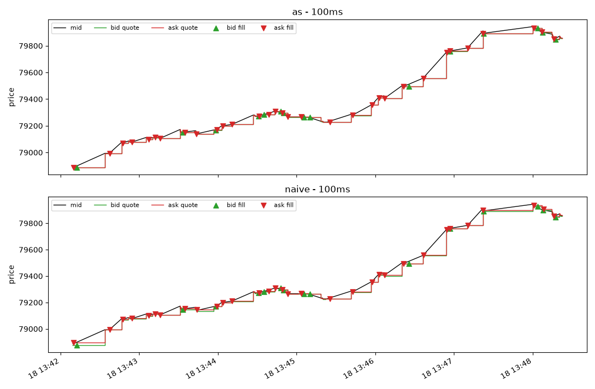
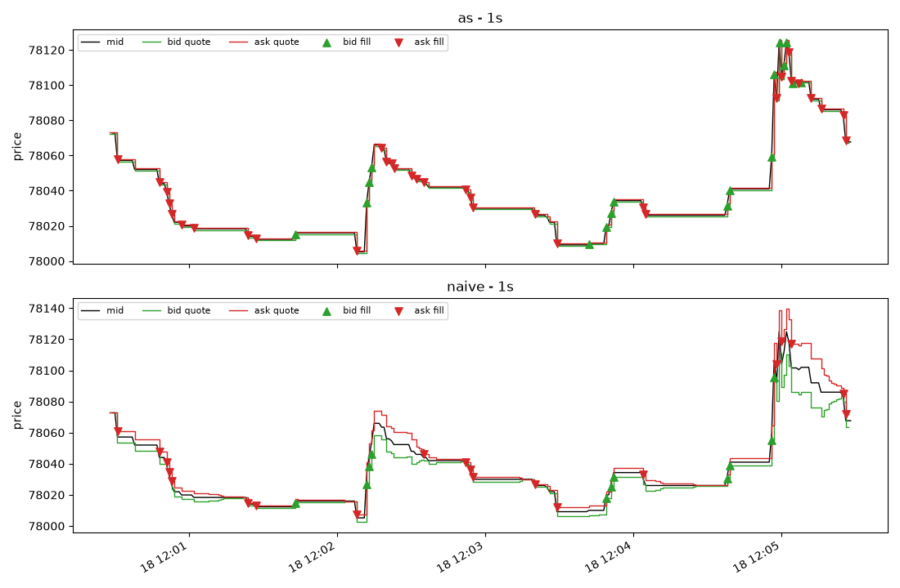
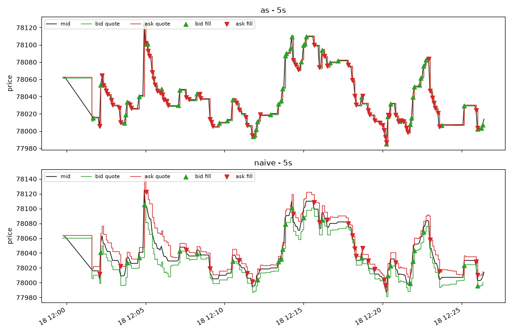
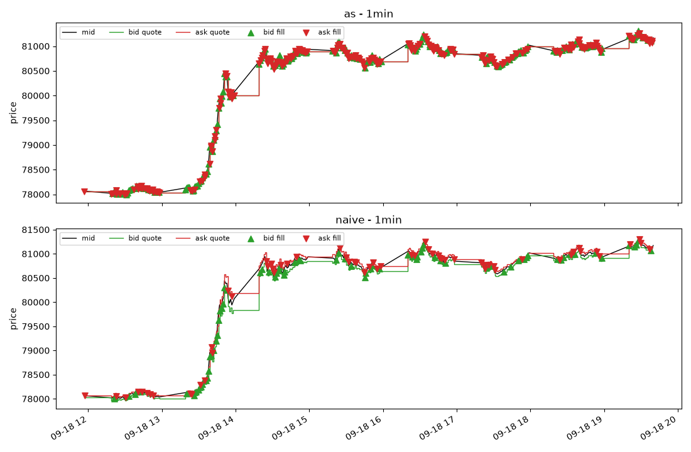
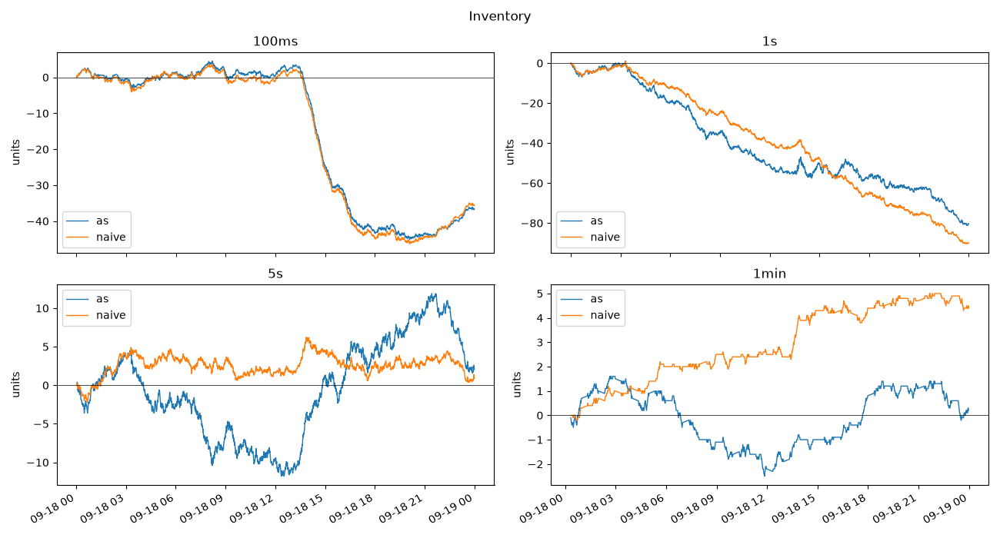
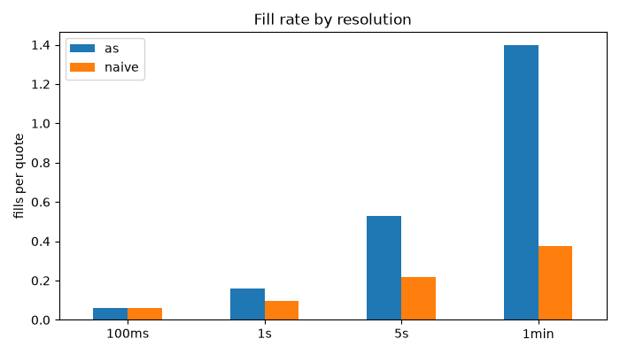
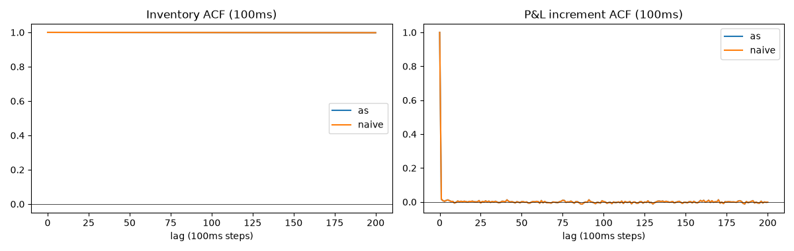
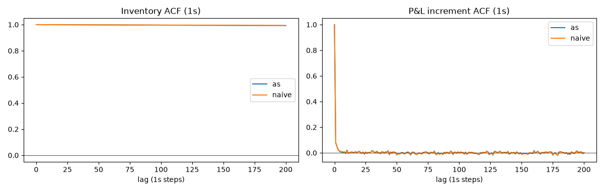
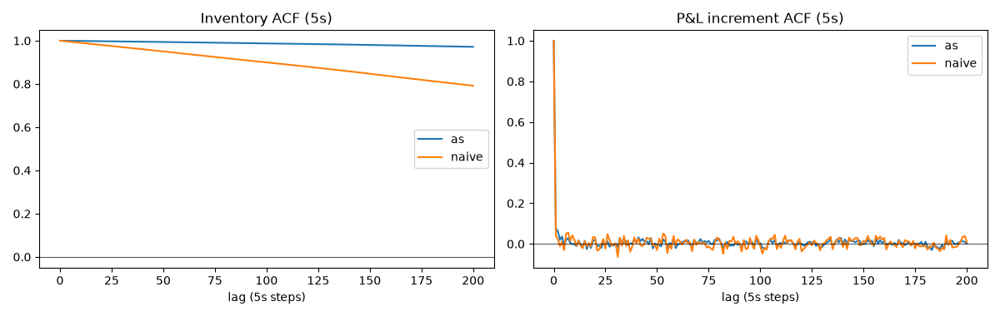
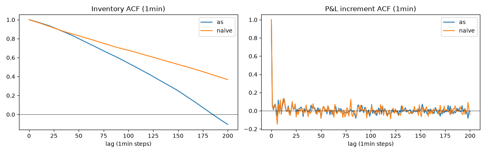

# Avellaneda-Stoikov Market Making: Backtest on Real BTCUSDT L2 Data

## Objective
Implement the Avellaneda-Stoikov (AS) market-making model, backtest it
on real L2 order book data, and compare it against a naive baseline across quoting
frequencies. 

This is a toy project for me to better understand market microstructure, trading strategies and their assumptions.

## Introduction

### What is market making?
A market maker continuously posts a bid and an ask, earns the spread when both
fill, and takes on inventory risk when only one side does.

### The Avellaneda-Stoikov model
The 2008 paper frames this as choosing quotes to maximise expected utility of
terminal wealth under inventory risk. Two key outputs:

- **Reservation price:** `r = s - q·γ·σ²·(T - t)`. The mid price `s` shifted
  against current inventory `q`, so a long position lowers both quotes to
  encourage selling.
- **Optimal spread:** `δ = γ·σ²·(T - t) + (2/γ)·ln(1 + γ/k)`
- Quotes are `r ± δ/2`.

γ (risk aversion) - the price the desk puts on P&L variance, 
σ (volatility) - rolling standard deviation of past 20 midprice changes, 
k (order-arrival intensity) - Decay of fill probability with distance from the mid, 
T - t (time remaining) - time left in a trading session (I chose 1 hour trading sessions). 

### Naive baseline
quote symmetrically around mid at a spread based on only volatility, with no inventory skew.

## Data
- **Source:** cryptohftdata.com, BTCUSDT L2 order book snapshots
- **Coverage:** hourly parquet files for 2026-09-18
- **Why only 24 hours:** raw L2 is huge: slow to load, too big for GitHub (and my computer)

## Approach

### Pipeline
`reconstruct → analyse → backtest → calculate_metrics → plot_data`

| Stage | What it does |
|---|---|
| `reconstruct` | rebuilds the ms-precision order book / best bid-ask |
| `analyse` | resamples to the quote frequency, computes mid, spread, rolling volatility |
| `backtest` | steps through quote times, places quotes, checks fills against HR data |
| `calculate_metrics` | Sharpe, drawdown, inventory, exposure, fill rate |
| `plot_data` | P&L, inventory, quotes, ACF, fill-rate charts |

### Two-resolution design
HR data (ms) is used to simulate fills. LR data (resampled to 100ms / 1s / 5s / 1min)
is used for strategy decisions. This lets me vary the quoting frequency while
keeping fill simulation precise.

### Fill logic
Bid fills if the market's best ask drops to or below it within (t0, t1]. Ask fills if the best bid rises to or above it. The earliest hit sets the fill time.
Quotes are decided at t0 using only information available at t0, by simulating forwards in time for each hour in my backtest.

### State across hours
Cash and inventory carry forward between hourly files so each result behaves as one
continuous session, although T-t resets.

### Parameters
| Parameter | Value |
|---|---|
| Initial cash | 1,000,000 |
| Order size | 0.1 |
| γ, k | 0.1, 1.5|
| Volatility window | past 20 midprice changes for the given resolution |

## Assumptions and Limitations
- **Optimistic fill model:** a touch counts as a full fill. There is no queue position, no partial fills and no latency.
- **No market impact:** My orders don't move the book; assumed by small order size. For 5sec, 1min trading frequency this would also have reduced market impact.
- **No fees or rebates:** Extra complication that I can think about later.
- **At most one fill per side per step**, of fixed size.
- **Quotes are frozen** between sample times.
- **Time horizon resets every hour:** because `backtest` is run hour by hour, the `T - t`
  term counts down to zero and then resets, producing a jump in the inventory
  skew.
- **Short sample:** only 24 hours' worth of data, so results are not statistically robust and may not generalise across regimes.
- **Sharpe** is computed on per-step returns, annualised assuming 24/7 trading and a
  zero risk-free rate.
- **One symbol:** Strategies only tested on BTCUSDT. 
- **Inventory Cap:** Currently no inventory cap, so strategies can hold negative inventory!

## Results
### Metrics


### Quotes
 
 
 
 

### Inventory


### Fill rate by resolution


### Autocorrelation





## Future Work
- Queue-position and latency modelling
- Maker fees and rebates
- Parameter calibration (γ, k) from data
- Multi-day, multi-asset testing
- Continuous session horizon instead of hourly resets

## How to Run
(first need to install hourly data from cryptohftdata.com)
```bash
pip install -r requirements.txt
python main.py
```

## References
- Avellaneda, M. & Stoikov, S. (2008). *High-frequency trading in a limit order book.*
  Quantitative Finance, 8(3).